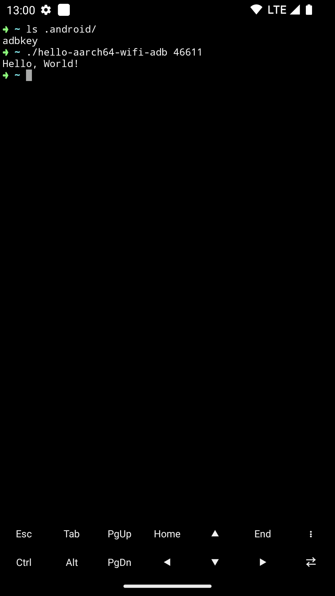

# Hello aarch64 wifi adb

一个 Android 11+ 上最小可执行的 mini wifi adb，但是只能输出 `Hello, World!`。

1. 开启 Android 11+ 的【无线调试】
2. 执行的 shell 需要有环境变量 `$HOME`
3. 拷贝你的密钥到 `$HOME/.android/adbkey`，该密钥需要已经配对过
4. 运行 `hello-aarch64-wifi-adb <port>` 即可看到 `Hello, World!`

